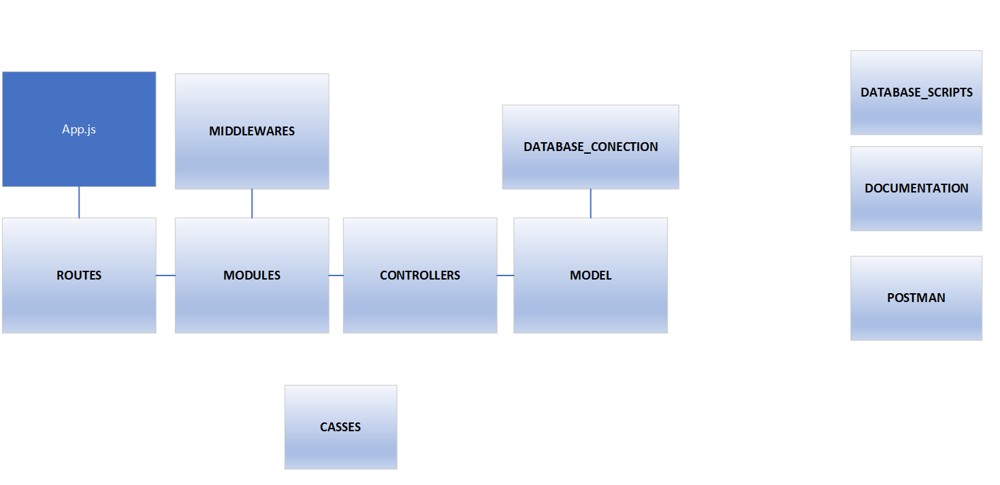

# **DELILAH RESTO Readme**

> API REST CRUD - Proyecto entregable 3 Acámica

## **1. Tecnologías aplicadas**

- [**NodeJS**](https://nodejs.org/es/)

- [**Librerías (npm)**](https://www.npmjs.com/)
  Los paquetes Node Package Manager (NPM) necesarios para el presente proyecto, se encuentran detallados en el archivo [package.json](https://github.com/Guillermo-Lerda/delilah_resto/blob/main/package.json) .
- [**mariadb**](https://mariadb.org/documentation/)

## **2. Accesos**

- [**Acceso al repositorio de código**](https://github.com/Guillermo-Lerda/delilah_resto.git)

- [**Postman**](https://www.postman.com/)

  El archivo con los request para probar los endpoints del proyecto para importar en Postman se encuentra en [postman/delilah.postman_collection.json](https://github.com/Guillermo-Lerda/delilah_resto/blob/main/postman/delilah.postman_collection.json), y los parámetros requeridos para cada operación, se encuentran definidos en la documentación realizada con Swagger.

- [**Acceso la documentación del proyecto en Swagger**](https://github.com/Guillermo-Lerda/delilah_resto/blob/main/documentation/delilah_resto.yaml)

- [**Acceso al archivo db_create.sql con los scripts para creación de la Base de Dato y de tablas**](https://github.com/Guillermo-Lerda/delilah_resto/tree/main/database_scripts/scripts/scripts)

- [**Acceso al archivo db_inserts.sql con los scripts para inserción de datos básicos en las tablas**](https://github.com/Guillermo-Lerda/delilah_resto/blob/main/database_scripts/scripts/scripts/db_inserts.sql)

- [**Acceso al archivo con la información de los puertos, la base, el host y user se encuentran en el siguiente archivo con las variable de entorno**](https://github.com/Guillermo-Lerda/delilah_resto/blob/main/.env)

## **3. Arquitectura de software**

> Modelo - Controlador

### **3.1. Gráfica**



### **3.2. Descripción**

| CARPETA                                                                                                         | CONTENIDO                                                                                         | DESCRIPCIÓN                                                                                      |
| --------------------------------------------------------------------------------------------------------------- | ------------------------------------------------------------------------------------------------- | ------------------------------------------------------------------------------------------------ |
| model                                                                                                           | modelos sequelize                                                                                 | sentencias sql                                                                                   |
| controllers                                                                                                     | implementación de métodos                                                                         | funciones que requiere cogigo de model e interactúa con la DB                                    |
| modules                                                                                                         | definición de metodos http, invoca middlewares y funciones de ejecución de la carpeta controllers | utilizar express.Router                                                                          |
| routes                                                                                                          | concentra los metodos http planteados en modules                                                  | establece primer parámeto del endpoint                                                           |
| classes                                                                                                         | objeto respuesta                                                                                  | reutilizable                                                                                     |
| database_conection                                                                                              | conexion con DB                                                                                   | consume archivos carpeta model                                                                   |
| [database_scripts](https://github.com/Guillermo-Lerda/delilah_resto/tree/main/database_scripts/scripts/scripts) | sentencias sql                                                                                    | sistema de gestión mysql creación DB, tablas e inserciones de registros                          |
| documentation                                                                                                   | formato json                                                                                      | archivo necesario para [documentación por Swagger](http://localhost:3000/delilah_documentation/) |
| postman                                                                                                         | formato json                                                                                      | archivo para importar en aplicación postman, que contiene endpoints                              |
| Raiz                                                                                                            | app.js                                                                                            | ejecución del servidor                                                                           |

## **4. Modelado y Gestión de base de datos**

> Se utilizó el modelo relacional

### **4.1. Diagrama de entidad relación**


### **4.2. Script SQL de creación de base de datos y tablas**

El [código](https://github.com/Guillermo-Lerda/delilah_resto/tree/main/database_scripts/scripts/scripts) se encuentra en el repositorio

```sql
CREATE DATABASE delilah_db;
USE delilah_db;

CREATE TABLE users (
  user_id INT(7) UNSIGNED NOT NULL AUTO_INCREMENT,
  email VARCHAR(50) NOT NULL,
  fullname VARCHAR(50) NOT NULL,
  phone VARCHAR(50) NOT NULL,
  adress VARCHAR(50) NOT NULL,
  user_password VARCHAR(50) NOT NULL,
  user_admin TINYINT(1) NOT NULL,
  PRIMARY KEY (user_id)
)ENGINE=InnoDB DEFAULT CHARSET=latin1;

CREATE TABLE products (
  product_id SMALLINT (6) UNSIGNED NOT NULL AUTO_INCREMENT,
  product_name VARCHAR(50) NOT NULL,
  product_description VARCHAR (255),
  product_price INT(10) UNSIGNED NOT NULL,
  product_disponibilty TINYINT(1) NOT NULL,
  PRIMARY KEY (product_id)
)ENGINE=InnoDB DEFAULT CHARSET=latin1;

CREATE TABLE payment_methods (
  payment_code TINYINT(2) UNSIGNED NOT NULL AUTO_INCREMENT,
  payment_description VARCHAR(20) NOT NULL,
  PRIMARY KEY (payment_code)
)ENGINE=InnoDB DEFAULT CHARSET=latin1;

CREATE TABLE order_status (
  order_status_code TINYINT(1) UNSIGNED NOT NULL AUTO_INCREMENT,
  order_status_description VARCHAR(20) NOT NULL,
  PRIMARY KEY (order_status_code)
)ENGINE=InnoDB DEFAULT CHARSET=latin1;

  CREATE TABLE orders (
    user_id INT(7) UNSIGNED,
    order_id INT(10) UNSIGNED NOT NULL AUTO_INCREMENT,
    payment_code TINYINT(2) UNSIGNED,
    order_time TIMESTAMP,
    order_status_code TINYINT(1) UNSIGNED,
    order_adress VARCHAR (255) NOT NULL,
    total INT(10) UNSIGNED,
    FOREIGN KEY (user_id) REFERENCES users(user_id),
    FOREIGN KEY (order_status_code) REFERENCES order_status (order_status_code),
    FOREIGN KEY (payment_code) REFERENCES payment_methods(payment_code),
    PRIMARY KEY (order_id)
  )ENGINE=InnoDB DEFAULT CHARSET=latin1;

CREATE TABLE order_products (
  order_id INT(10) UNSIGNED,
  product_id SMALLINT(6) UNSIGNED,
  product_quantity TINYINT(3) UNSIGNED NOT NULL,
  FOREIGN KEY (order_id) REFERENCES orders (order_id),
  FOREIGN KEY (product_id) REFERENCES products (product_id),
  PRIMARY KEY (order_id, product_id)
)ENGINE=InnoDB DEFAULT CHARSET=latin1;
```

### **4.3. Script SQL de inserción de registros**

El [código](https://github.com/Guillermo-Lerda/delilah_resto/blob/main/database_scripts/scripts/scripts/db_inserts.sql) se encuentra en el repositorio con el fin de poder utilizar las funcionalidades del sistema

```sql
INSERT INTO products (product_name,product_description,product_price,product_disponibilty) VALUES
('Hamburguesa Simple','Hamburguesa con tomate, lechuga y papas fritas',500,1),
('Hamburguesa Completa','Hamburguesa con tomate, lechuga, huevo y papas fritas',700,1),
('Milanesa Completa','Milanesa con tomate, lechuga, huevo y papas fritas',600,1);

INSERT INTO payment_methods (payment_description) VALUES
('Pendiente'),
('Efectivo'),
('Tarjeta');

INSERT INTO order_status (order_status_description) VALUES
('Pendiente'),
('Cancelado'),
('Confirmado'),
('En Preparación'),
('En Camino'),
('Entregado');
```
